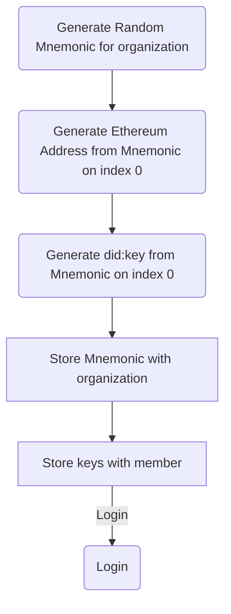

# Session

The contents of this folder are for handling requests on the `/api/session/` route.

## Signup

**Authentication**: Not Required

**Description**: Allows for new users to signup by proving a new organization, and user information to act as admin for that organization.

## Login

**Authentication**: Not Required

**Description**: Allows for users to sign in with a username and password in order to receive a cookie which is used to identify the user on the server side. This functionality should probably be updated to use a JWT (JSON Web Token) to simplify the security model.

## Check

**Authentication**: Required

**Description**: Queries the server to get the information that is contained on the server side cache, that identifies the user for that session.

## Logout

**Authentication**: Required

**Description**: Clears the user's cookie from their browser requests. 
